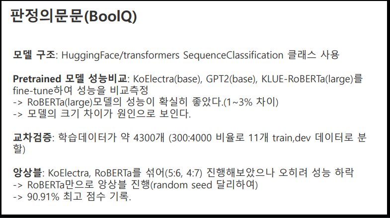
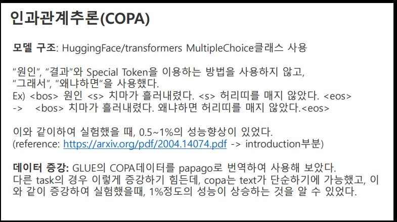
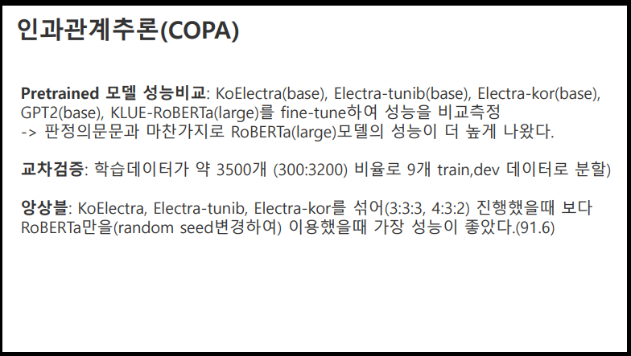
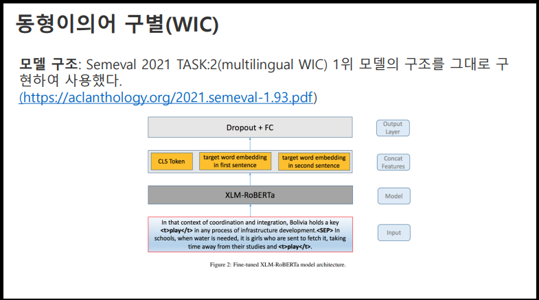
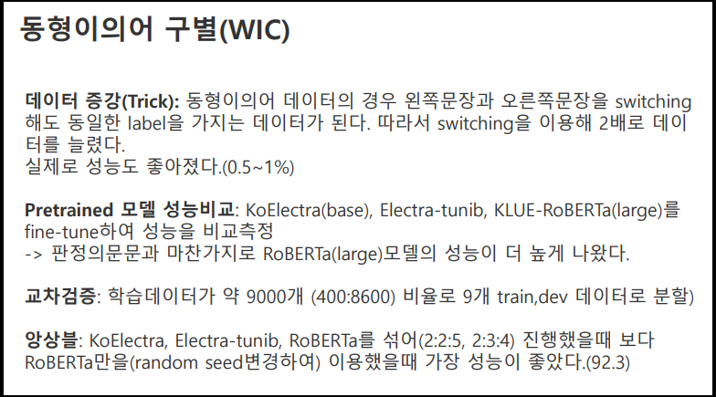
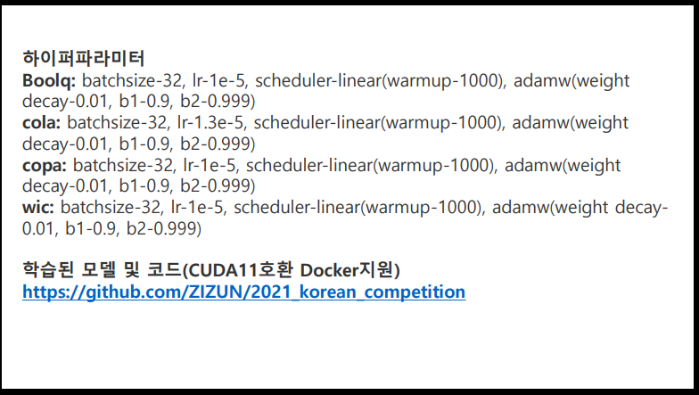

# 2021_korean_competition
2021 국립국어원 인공 지능 언어 능력 평가 (화성갈끄니까 팀)

## 각 Task별 Train 코드

1. Environment Setting
```console

pip install -r requirements.txt

```
2. Train 코드 실행
```console
bash boolq.sh roberta [bsz]
bash cola.sh roberta [bsz]
bash copa.sh roberta [bsz]
bash wic.sh roberta [bsz]
```

## Docker build and 모델 평가 방법(CUDA11지원, 현재 모델 파라미터, 데이터 제공X)

1. Docker Image build & container 실행
```console
git clone https://github.com/ZIZUN/2021_korean_competition.git
cd 2021_korean_competition
docker build -t rocket
docker run --gpus 1 --rm -it rocket
```
2. Conda Environment Setting
```console
conda activate rocket
pip install -r requirements.txt
```
3. 평가용 데이터 삽입(./data/boolq/ , ... 각 4가지 Task별 폴더에 삽입)

<참고> boolq - 판정의문문, cola - 문법성판단, copa - 인과관계추론, wic - 동형이의어

4. evaluation 코드(get_result.py)를 arguments(데이터 경로, batchsize 등)와 함께 실행 (40분 정도 소요)
```console
python get_result.py --batch_size 100 --num_worker 5 --boolq_data_path 'data/boolq/_.tsv' --cola_data_path 'data/cola/_.tsv' --copa_data_path 'data/copa/_.tsv' --wic_data_path 'data/wic/_.tsv' --result_file_name 'result.json' --device 'cuda:0'
```

5. 평가가 완료되면 './result/' 경로에 결과파일(tsv)이 저장된다.


## Solution

 
 
 
 
 
 
 
